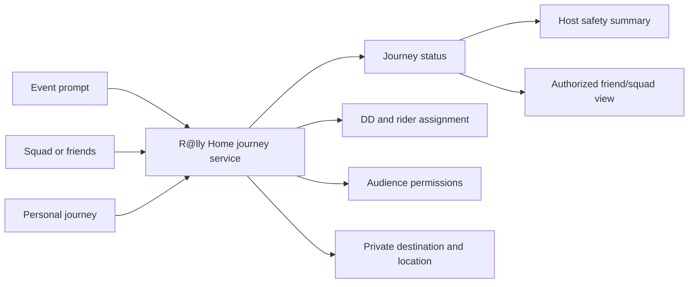

# R@lly Home Build Plan

Date: August 22, 2026  
Project: R@lly Code Review  
Priority: Number one product and engineering priority  
Target release: Version 2 — background tracking plus precise UWB finding with Bluetooth fallback  
Plan status: Approved direction; no implementation performed by creating this document

## 1. Outcome

Build one dependable R@lly Home safety engine that supports both:

1. **Event mode:** R@lly Home is connected to an active R@lly and can provide privacy-safe status to the host.
2. **Private mode:** R@lly Home works without an event, or is shared only with selected friends/squad members.

The two entry points remain. They will stop maintaining conflicting safety records.

When this plan is complete:

- A user can make a clear travel choice and change it safely.
- DDs and riders see the same assignment and status.
- Driver departure notifications work.
- DDs can confirm assigned passenger drop-offs.
- Destinations and live locations are visible only to authorized people.
- Automatic arrival is offered only when the device can actually support it.
- Manual safe-arrival confirmation always remains available.
- The Host Safety Dashboard is current, accurate, and privacy-safe.
- Event and private R@lly Home use the same rules and journey records.

### Core tracking promise

R@lly Home is intended to replace the feeling that people must share their location continuously through a general-purpose family/friend tracker. R@lly sharing is temporary and purpose-based:

- Share for this event, night out, or trip home
- Choose exactly who can see the location
- Keep sharing while the app is backgrounded on supported native devices
- Show the traveler clearly that sharing is active
- Stop automatically when the journey/event sharing window ends
- Never silently turn a temporary session into permanent tracking

This is not merely a map feature. Temporary live tracking, privacy, DD/rider coordination, and safe-arrival closeout are one product.

## 2. Product rules that must not change

- R@lly Home must work without an active event.
- A user must be able to share only with selected friends or a squad.
- Joining an event must not automatically expose a destination or live location.
- Event hosts need to know whether attendees have made a safety decision, but they do not automatically need private travel details.
- A user can decline event tracking and still use a private R@lly Home journey.
- “Not tracked by the host” must never be displayed as “arrived safely.”
- A DD-confirmed drop-off and a rider-confirmed arrival must resolve to the same final safety result.
- Location tracking must stop when the journey ends, is cancelled, or sharing is withdrawn.

## 3. User-facing model

### Ways to start

| Starting place | Event required? | Default audience |
|---|---:|---|
| Event R@lly Home prompt | Yes | Traveler plus privacy-safe host status |
| Event DD/rider setup | Yes | Driver/riders; host gets privacy-safe status |
| Squad R@lly Home card | No | Selected squad participants |
| Friends-only R@lly Home | No | Selected friends |
| Personal “Get Me Home” | No | Traveler only until people are selected |

### Travel choices

Replace ambiguous “I’m good” choices with explicit options:

- **I’m driving / I’m the DD**
- **I’m riding with a DD**
- **I’m arranging my own ride**
- **I’m staying / decide later**
- **Don’t include me in event tracking**

The final wording should be tested on mobile, but each button must map to exactly one state transition.

### Journey states

| State | Plain meaning | Allowed next states |
|---|---|---|
| `planning` | Travel choice started but required details are incomplete | `ready`, `declined`, `cancelled` |
| `ready` | Plan is complete; traveler has not departed | `en_route`, `declined`, `cancelled` |
| `en_route` | Journey home has started | `arrived`, `cancelled` |
| `arrived` | Safe arrival/drop-off confirmed | Final |
| `declined` | User declined this tracking context | Final for that context |
| `cancelled` | Journey was intentionally stopped | Final |

“Undecided” is not stored as a journey state. In an event, it means the attendee has no event-linked journey and has not declined event tracking.

### Transport modes

- `self_driver`
- `dd_driver`
- `dd_rider`
- `rideshare_or_taxi`
- `other_self_arranged`

Transport and journey status remain separate so changing a ride does not incorrectly mark someone safe or departed.

## 4. Privacy and sharing model

Sharing is permission-based, not inferred merely from event attendance.

### Information levels

| Level | Information | Typical viewers |
|---|---|---|
| Safety status | Planning, ready, en route, arrived, or not tracked | User-approved host/friends/squad |
| Plan details | Transport mode, DD/rider assignment | Assigned car group and approved host |
| Destination label | User-entered destination name | Explicitly selected viewers |
| Live location | Latest coordinates and update time | Explicitly selected viewers only |

### Audience permissions

Each approved viewer receives separate permissions:

- Can view safety status
- Can view transport/ride assignment
- Can view destination
- Can view live location
- Can receive journey notifications

The journey owner always has full access. Event membership alone does not grant destination or location access.

### Temporary tracking-session lifecycle

Every live-sharing session must have:

- A clear start action and purpose: event, night out, or trip home
- A selected audience
- A visible “Location sharing is on” indicator and immediate stop control
- `started_at`, `last_update_at`, and an explicit `expires_at`
- A configurable safety grace period rather than indefinite sharing
- Automatic stop on arrival, cancellation, manual stop, logout/account disablement, or expiration
- A stale-location label when the device has not reported recently
- A notification to the traveler when sharing stops or expires

The initial implementation stores only the latest location needed for live coordination. It does not build a permanent route history.

### Host behavior

For an attendee using private R@lly Home without host sharing, the dashboard displays:

- **Private/self-managed — not tracked by host**

It does not display destination, live location, private squad, or selected friends. This status counts as **resolved for event closeout**, but not as **verified safe**. Host totals must show these as separate numbers.

## 5. Technical design

### Background-geolocation technology decision

**Primary recommendation:** pilot `@transistorsoft/capacitor-background-geolocation` for the native iOS/Android builds.

**Verified license cost (August 22, 2026):** the Starter plan is $399 for one application, covering both its iOS bundle identifier and Android application ID for unlimited users/devices. The license is perpetual and includes one year of updates/support. After that, the installed licensed version continues working; optional renewed updates/priority support are currently $199 per year. Debug builds require no license, and a 30-day release-build trial is available. R@lly does not need the optional Firebase adapter because the SDK can upload to a Supabase server endpoint through its built-in HTTP service. Circular geofencing is included; polygon geofencing is an optional add-on and is not required by this plan.

Why it is the preferred production candidate:

- Current releases support Capacitor 8, matching the R@lly project.
- It is designed for background and terminated-state location work rather than only foreground `watchPosition` calls.
- Motion-aware tracking can stop high-power GPS work while the phone is stationary.
- Native buffering and HTTP upload can continue when the JavaScript/WebView layer is unavailable.
- It includes geofencing, lifecycle events, authorization handling, and a real-device example application.
- Debug builds work without a license and release builds can use a trial, allowing proof before purchase.

**Lower-cost fallback:** evaluate `@capgo/background-geolocation` v8. It explicitly supports Capacitor 8 and provides background tracking/geofencing, but it must pass the same iOS/Android device, battery, network-loss, and app-termination test matrix before selection.

**Do not select for this build:** `@capacitor-community/background-geolocation` until it officially supports Capacitor 8 and demonstrates the accuracy/reliability required by R@lly Home. Its published compatibility currently stops at Capacitor 7 and it lacks the richer native delivery/geofencing features needed for this safety-critical experience.

Package selection is not enough by itself. The implementation also requires native iOS/Android permissions and services, encrypted server upload, realtime authorized reads, expiry/stop enforcement, and map navigation.

### “Find My”-style boundary

R@lly can provide an authorized **Navigate to Friend** experience:

1. Obtain the opted-in friend's latest or live location during an active sharing session.
2. Show accuracy and how old the location is.
3. Display the friend on the R@lly map.
4. Open turn-by-turn walking/driving navigation to that coordinate.
5. Refresh while the friend's sharing session remains active.

R@lly must not promise Apple's lost-device capability. A third-party package does not gain access to Apple's crowdsourced Find My network. If the phone is powered off, has no usable connection, has revoked location permission, or can no longer run R@lly's approved native service, R@lly can show only the last successfully reported point and its age.

For iOS, a later reliability enhancement can evaluate Apple's Location Push Service Extension. It is intended for approved person-to-person location-sharing apps to request an opted-in user's location through APNs even when the main app is not running. It requires Always authorization, an iOS extension/entitlement, server support, encryption, rate discipline, and Apple review; it complements rather than replaces the background SDK.

### Crowded-place “Find Nearby” design

GPS alone cannot reliably point to one person in a dense crowd or indoor venue. R@lly should use a layered handoff:

1. **Approach:** background GPS and the R@lly map guide the finder to the friend's latest reported area.
2. **Nearby:** inside a configurable radius, both users can start an explicit Find Nearby session.
3. **Precise supported devices:** use native Ultra Wideband ranging to show distance and an arrow. On supported iPhones, Apple's Nearby Interaction provides peer distance/direction; Android UWB support is limited to specific models. This requires a custom Capacitor native bridge and device capability checks.
4. **Universal fallback:** use foreground Bluetooth LE signal strength for broad “far / near / very close” feedback. BLE does not provide dependable direction or exact distance.
5. **Human confirmation:** show a shared temporary color/symbol, allow a controlled sound/vibration/flash request, and offer a short landmark message such as “near the north bar.”

The UI must never display false precision. It shows GPS accuracy, location age, and whether guidance is GPS, Bluetooth proximity, or precise UWB. Nearby sessions require both users' active consent and automatically expire.

### Expected external cost envelope

| Item | Expected cost | Notes |
|---|---:|---|
| Transistorsoft Starter | $399 one time | Native background-location engine for one R@lly app on iOS and Android |
| Optional Transistorsoft updates/support after year one | $199/year | Existing licensed version continues working without renewal |
| Supabase production | From $25/month | Current Pro tier includes 5 million realtime messages; overage is currently $2.50 per million |
| Mapbox Directions | Usage based | Current free tier includes 100,000 directions requests/month; then currently starts at $2 per 1,000 |
| Apple Developer Program | $99/year | Required for App Store/TestFlight; likely already part of R@lly operations |
| BLE proximity | No new SDK fee expected | R@lly already includes a Capacitor Bluetooth LE package; custom implementation/testing remains |
| UWB precise finder | No standard vendor fee assumed | Requires custom iOS/Android native bridge, supported devices, and substantial engineering/device QA |
| Apple Location Push extension | No package fee | Requires custom native/server work, entitlement, Always authorization, and Apple review |

The first production version does not require purchasing another location package beyond Transistorsoft. The major remaining investment is implementation and real-device testing, especially for precise UWB finding.

### One engine, multiple contexts

### New canonical records

#### `rally_home_journeys`

Non-sensitive journey state:

- `id`
- `traveler_profile_id`
- `event_id` — optional
- `squad_id` — optional
- `created_by`
- `status`
- `transport_mode`
- `started_at`
- `arrived_at`
- `ended_at`
- `arrival_confirmed_by` — traveler, DD, or authorized safety contact
- `source` — event, squad, friends, or personal
- `created_at`, `updated_at`

#### `rally_home_private_details`

Sensitive one-to-one journey data:

- `journey_id`
- `destination_name`
- `destination_lat`, `destination_lng`
- `latest_lat`, `latest_lng`
- `latest_location_at`
- `location_sharing_active`

Keeping sensitive columns separate prevents ordinary status queries from accidentally returning location data.

#### `rally_home_audience`

One row per approved viewer:

- `journey_id`
- `viewer_profile_id`
- `relationship` — host, DD, rider, squad, friend, safety contact
- `can_view_status`
- `can_view_ride_plan`
- `can_view_destination`
- `can_view_location`
- `can_receive_notifications`
- `granted_at`, `revoked_at`

#### Ride connection

Keep the existing `rides` and `ride_passengers` records initially. Add a journey connection so one accepted/confirmed passenger and one DD assignment resolve to the same journey. Normalize accepted rider states through one shared function instead of interpreting strings differently in each screen.

### Server-owned actions

UI components must stop directly updating combinations of safety flags. Provide server actions for:

- Start a journey
- Choose/change transport
- Assign or accept a DD/rider
- Set destination
- Change audience permissions
- Start departure
- Confirm arrival
- DD confirm passenger drop-off
- Decline event tracking
- Cancel journey

Each action validates the caller, allowed previous state, event/squad relationship, and privacy permissions. Each action updates all related values in one transaction.

### Read contracts

- **My journey:** full record for the traveler
- **Authorized journey:** only fields allowed by the viewer's audience permissions
- **Host event safety summary:** safety status and approved plan details, never raw private location by default
- **Car group:** assignment, readiness, departure, and drop-off fields required by the DD/riders

The app must not select raw sensitive journey columns for lists or dashboards.

## 6. Build phases

### Phase A — Lock the behavior with tests first

**Purpose:** prevent the rebuild from changing the intended product behavior.

Tasks:

1. Add a shared journey-state definition and transition table.
2. Add unit tests for every valid and invalid transition.
3. Add privacy-matrix tests for owner, host, whole event, DD/rider, squad, selected friend, and unrelated user.
4. Add regression tests for the confirmed current bugs:
   - auto-open prompt remains visible
   - `dd_departure` is accepted and errors are detected
   - accepted and confirmed riders behave identically
   - assigned riders appear in DD drop-off controls
   - a private journey never exposes its destination to the event

**Exit gate:** tests fail against the broken behavior and describe the intended replacement behavior.

### Phase B — Add the canonical database model

**Purpose:** create the new engine without breaking current users.

Tasks:

1. Add the three canonical tables and required indexes.
2. Add strict row-level policies and server functions.
3. Do not grant ordinary clients direct access to private location columns.
4. Add an event safety-summary function that derives `awaiting_decision`, `ready`, `en_route`, `safe`, or `private_not_tracked`.
5. Add audit fields for who confirmed arrival/drop-off.
6. Add expiration/cleanup rules for live coordinates after journey completion.
7. Regenerate TypeScript database types.

**Exit gate:** database permission tests prove an unrelated user, ordinary event attendee, and unapproved host cannot access restricted destination/location data.

### Phase C — Add one application journey service

**Purpose:** stop components from inventing their own safety rules.

Tasks:

1. Add a typed R@lly Home service/hook layer.
2. Centralize status labels, transition rules, completion logic, and rider-status normalization.
3. Add realtime updates for journey, audience, and car-group changes.
4. Add explicit error states and retry behavior.
5. During migration, read the new model first and temporarily fall back to legacy records when no new journey exists.

**Exit gate:** event, squad, and private components can read the same test journey and display the same authorized status.

### Phase D — Repair prompts and choices

**Purpose:** make the starting experience dependable and understandable.

Tasks:

1. Fix the auto-open lifecycle so the dialog remains mounted.
2. Consolidate overlapping session-memory and database prompt gates.
3. Use explicit travel choices and descriptions.
4. Make changing a choice clear incompatible fields atomically through the journey service.
5. Provide event, squad/friends, and personal entry points using the same form steps.
6. Make dismissal behavior explicit: decide later, decline event tracking, or cancel.

**Exit gate:** prompt behavior passes reload, second-device, event transition, bar-hop transition, and repeated-open tests.

### Phase E — Repair DD and rider workflow

**Purpose:** create one reliable car-group flow.

Tasks:

1. Normalize accepted/confirmed rider status.
2. Ensure driver and rider screens display the same assignment.
3. Allow a DD to start departure and notify all assigned accepted/confirmed riders.
4. Add/normalize the server notification type and inspect returned function errors.
5. Allow a DD to confirm any assigned rider's drop-off without requiring a separate rider departure click.
6. Record one canonical arrival result with the confirmer's identity.
7. Handle driver cancellation, rider cancellation, reassignment, full ride, and duplicate confirmation.

**Exit gate:** host, DD, and two riders complete the full flow on separate accounts with no contradictory status.

### Phase F — Repair destination and location tracking

**Purpose:** make tracking truthful, private, and reliable.

Tasks:

1. Require successful geocoding before promising automatic arrival.
2. Explain when only manual confirmation is available.
3. Request location permission only after explaining audience, purpose, and automatic stopping.
4. Add the temporary tracking-session lifecycle with `started_at`, `expires_at`, active/stale/stopped state, and an always-available stop control.
5. Write live location through the private server contract.
6. Implement dependable native background updates for iOS and Android, including the required permission descriptions, platform configuration, app-state handling, and TestFlight/device testing.
7. Treat the web/PWA experience as foreground or best-effort tracking and explain that limitation instead of promising continuous background updates.
8. Use adaptive update frequency based on motion, journey stage, battery needs, and staleness requirements; do not run high-accuracy GPS continuously when it is unnecessary.
9. Stop watching on arrival, cancellation, logout, sharing withdrawal, expired journey, or account disablement.
10. Do not retain a location history unless a separately approved product need exists.
11. Make the 100-meter auto-arrival threshold configurable and test false-positive scenarios.
12. Ensure the success message distinguishes “arrival recorded” from “notifications delivered.”

**Exit gate:** location tests cover permission denied, no coordinates, iOS/Android background and foreground behavior on real devices, terminated/relaunched app behavior, stale coordinates, battery use, expiration, revoked sharing, manual arrival, and auto-arrival.

### Phase G — Rebuild Host Safety Dashboard and completion

**Purpose:** give hosts an accurate closeout tool without violating privacy.

Dashboard groups:

- Awaiting a decision
- Plan ready
- En route
- Confirmed safe
- Private/self-managed — not tracked by host

Tasks:

1. Read one server-generated event safety summary.
2. Subscribe directly to relevant realtime changes.
3. Separate `confirmed safe` from `resolved but not tracked` totals.
4. Make event closeout require every attendee to be resolved, not falsely “safe.”
5. Use the same summary for badges, analytics, notifications, and completion overlays.
6. Show timestamps and stale-status warnings where helpful.
7. Prevent the dashboard from exposing private destinations or audiences.

**Exit gate:** the dashboard updates correctly on a second device and its totals always equal the attendee list.

### Phase H — Migrate private/squad R@lly Home

**Purpose:** preserve standalone use while eliminating the second behavior engine.

Tasks:

1. Move Squad R@lly Home UI to the canonical journey service.
2. Add friends-only and personal journey creation paths if not already exposed.
3. Migrate active legacy squad sessions/participants safely.
4. Preserve completed history as read-only legacy history or migrate it after verification.
5. Confirm that an event-linked private journey shares only the user's selected information.

**Exit gate:** R@lly Home works with no event, with a squad, with selected friends, and during an event without exposing data to the event audience.

### Phase I — Cutover and legacy cleanup

**Purpose:** remove contradictory code only after the new path is proven.

Tasks:

1. Enable the new engine behind a feature flag for test accounts.
2. Run migration comparison reports; do not include raw location in logs.
3. Expand gradually to internal users, then a small production group, then all users.
4. Stop legacy writes after the new engine is stable.
5. Remove legacy R@lly Home state logic from `event_attendees` and `rally_home_participants` only after a rollback window.
6. Remove duplicate hooks, completion formulas, and notification logic.

**Exit gate:** no active screen writes legacy safety flags, production monitoring is stable, and rollback is no longer required.

## 7. End-to-end test matrix

Every row must be tested on at least two accounts/devices where applicable.

| Scenario | Required result |
|---|---|
| Event attendee chooses self-arranged ride | Host sees plan status; destination remains private unless shared |
| Event attendee declines host tracking | Host sees private/not tracked; attendee may still start friends-only journey |
| DD accepts two riders and departs | Both riders receive accepted departure alert and see the same DD |
| Confirmed-status rider | Behaves exactly like accepted-status rider during migration |
| DD drops off rider | Rider and host summary update once; duplicate confirmation is harmless |
| Rider confirms own arrival first | Later DD confirmation does not create a contradictory state |
| Destination cannot be geocoded | User is told automatic arrival is unavailable and can confirm manually |
| Location permission denied | Journey remains usable without live tracking |
| Location sharing revoked en route | New coordinates stop; unauthorized viewers lose access immediately |
| Sharing session expires | Native tracking stops, viewers lose live access, and the traveler is informed |
| App moves to background during active sharing | Supported native builds continue the approved temporary session; web clearly reports best-effort limits |
| Location becomes stale | Viewers see the age/stale warning rather than an apparently current dot |
| Private journey without event | Selected friends see only granted fields; no event is required |
| Event-linked friends-only journey | Host sees only privacy-safe resolution; general attendees see nothing |
| Host dashboard on second device | Updates promptly and totals remain accurate |
| User reloads or changes device | Journey resumes from server state without repeating completed prompts |
| Network fails during transition | UI reports failure/retry and does not claim success prematurely |

## 8. Monitoring and safety checks

Track without storing destinations or coordinates in analytics:

- Journey transition success/failure rate
- Notification request accepted/failed rate by type
- Time from ready to departure and departure to resolved status
- Count of stale en-route journeys
- Auto-arrival attempted/succeeded/manual fallback counts
- Active tracking sessions, expired sessions, and sessions that failed to stop cleanly
- Location-update age and battery-impact measurements without recording coordinates in analytics
- Host dashboard data-refresh failures
- Permission-denied attempts against private journey data
- Difference between dashboard totals and attendee count; expected to remain zero

Alert on repeated transition failures, rejected DD-departure notifications, privacy-policy denials rising unexpectedly, or dashboard count mismatches.

## 9. Rollout and rollback

- All database changes are additive first.
- Keep legacy reads available during the controlled rollout.
- Use a feature flag to switch test users between legacy and canonical engines.
- Never dual-write sensitive live coordinates to both models.
- If a rollout gate fails, disable the new UI path; retain new records for diagnosis without deleting user data.
- Remove legacy columns/tables only in a later migration after production stability and a backup/rollback window.

## 10. Lovable-credit-efficient execution

Use one focused build request per phase instead of many conversational fixes.

Recommended batches:

1. Tests and shared state definitions
2. Additive schema, server actions, and privacy tests
3. Application journey service and realtime reads
4. Prompt/choice repair
5. DD/rider repair and notifications
6. Destination/location repair
7. Host Dashboard and completion
8. Private/squad migration and controlled cutover

For every batch:

- Provide exact owned files and acceptance tests in the first request.
- Ask for source changes and local verification only—no deployment.
- Run typecheck and focused tests during development.
- Run the full test/build suite once at the batch gate, not after every small edit.
- Review the diff before starting the next batch.
- Do not spend credits on visual polish until workflow, privacy, and device tests pass.

## 10A. GitLab delivery plan

Use GitLab as the source-control, testing, security, release, and project-management backbone for Version 2. It does not provide location or UWB technology; it makes the native work safer and more repeatable.

### Repository and work organization

- Keep one protected production branch and short-lived feature branches.
- Create one R@lly Home epic with issues matching Phases A–I.
- Require merge requests, passing pipelines, and reviewed database migrations before merge.
- Protect production variables and release environments.
- Store architecture decisions, privacy matrix, test evidence, and device results with the related issue.

### Pipeline stages

1. **Validate:** dependency install, TypeScript, focused unit tests, lint on touched files, schema checks.
2. **Security:** secret detection, SAST, dependency/SBOM scanning, and migration-policy tests.
3. **Web build:** production Vite build and artifact.
4. **Android native build:** Capacitor sync, Gradle unit/build checks, signed internal-test artifact.
5. **iOS native build:** Capacitor sync, Xcode build/tests, signed TestFlight artifact using a macOS runner.
6. **Integration:** Supabase test project, server-action authorization tests, and realtime contract tests.
7. **Release gate:** manual approval after real-device tracking/UWB results are attached.

### Secure files and secrets

Use GitLab protected/masked variables and project-level secure files for:

- Apple signing certificate and provisioning profile
- Android signing keystore
- Transistorsoft iOS/Android license keys
- Mapbox build token
- Test Supabase configuration
- APNs/FCM deployment credentials

Production service-role secrets must never enter the mobile build. CI jobs receive only the minimum environment-specific secret they require.

### Runner strategy

- Linux hosted runners handle web, database, security, and Android work.
- GitLab Premium/Ultimate macOS hosted runners can build iOS and include Fastlane, but the service is currently beta and has queue/headless limitations.
- Begin with the hosted macOS runner for build/sign/archive automation.
- Use a dedicated self-managed Mac runner later if beta queue reliability becomes a release bottleneck. Self-managed runner time does not consume GitLab hosted compute minutes.
- Do not treat hosted simulators as proof of GPS, Bluetooth, background lifecycle, or UWB behavior.

### Physical-device gate

GitLab records and enforces the result, but real iPhones and Android phones perform the test. Each release candidate must attach a device matrix covering:

- Background, locked screen, termination/relaunch, and network recovery
- Permission downgrade/revocation and session expiration
- Battery-impact run
- iPhone-to-iPhone UWB
- Supported Android-to-Android UWB
- Mixed/unsupported-device Bluetooth fallback
- Dense crowd/obstruction and indoor/outdoor accuracy

No production deployment occurs solely because CI is green.

### Confirmed GitLab nonprofit benefit

The approval email confirms eligibility for GitLab for Nonprofits: Ultimate for one year, SaaS or Self-Managed, for up to 20 seats at $0 when the claim is applied correctly. GitLab's published nonprofit terms state that support is not included and the program must be renewed; future terms can change.

Recommended choice for R@lly: **GitLab.com SaaS**. It avoids operating and securing a separate GitLab server, supports Lovable's direct two-way GitLab connection, and provides hosted Linux/macOS runners. Self-Managed would add server administration, upgrades, backups, monitoring, and security work without improving R@lly Home.

Request the largest realistic team estimate because the approval email says seats cannot be increased outside renewal. Up to 20 seats are permitted, but only actual trusted collaborators should be invited. The subscription must be attached to a top-level nonprofit group, not a personal namespace.

Current published Ultimate allowance is 50,000 hosted compute minutes per month and 500 GiB per project—not unlimited hosted runner time. Jobs on self-managed runners are not charged against that hosted-minute quota.

## 11. Definition of done

R@lly Home is complete only when:

- Both event and private modes use the same journey engine.
- All state changes go through validated server actions.
- All privacy-matrix tests pass.
- DD/rider assignments, departure, and drop-off work across devices.
- Destinations and locations never appear for unauthorized viewers.
- Native temporary sharing continues reliably through the supported event/night window and always stops at its end.
- The traveler can always see and stop active sharing.
- The product stores a latest location, not an indefinite movement history.
- Manual arrival always works and automatic arrival is described honestly.
- Host Dashboard totals are accurate and distinguish safe from not tracked.
- Full event and private end-to-end tests pass.
- Legacy safety writes are disabled and duplicate logic is removed.
- Monitoring and rollback procedures are in place.

## 12. Decisions to confirm before implementation reaches those steps

These do not block Phase A, but must be resolved before their related UI is finalized:

1. Whether an event host receives safety-status visibility by default with a clear opt-out, or only after explicit attendee opt-in.
2. Whether a host may see DD/rider assignments by default, or only the high-level journey status.
3. How long completed journey records are retained.
4. How quickly live coordinates are erased after arrival/cancellation.
5. The maximum default event/night sharing window and safety grace period before automatic expiration.

Recommended defaults: hosts receive status-only visibility for event attendees, while destination and live location always require explicit sharing. “Private/not tracked” resolves event closeout but never counts as confirmed safe. Dependable background tracking is a native iOS/Android promise; web tracking is presented as best effort. Sharing automatically expires and retains only the latest point required for the active session.
